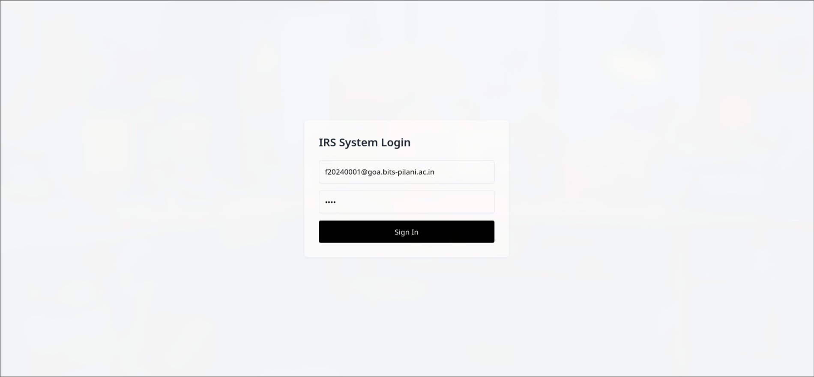
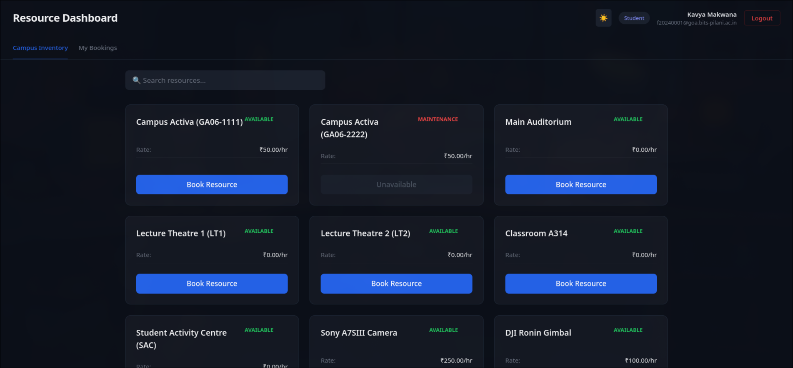
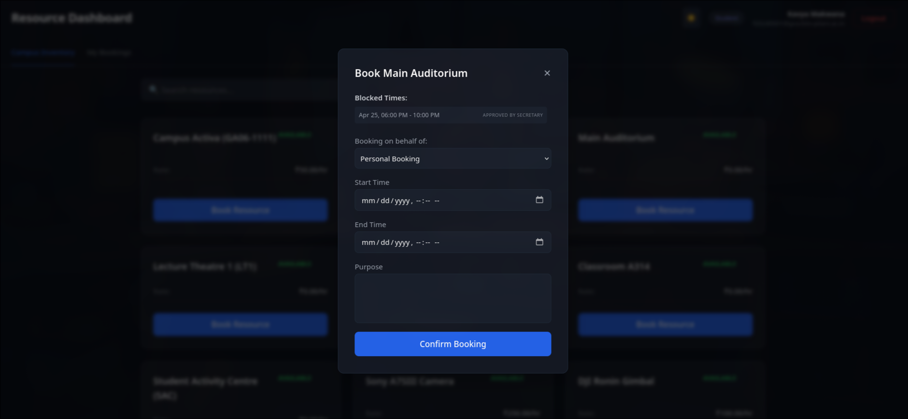
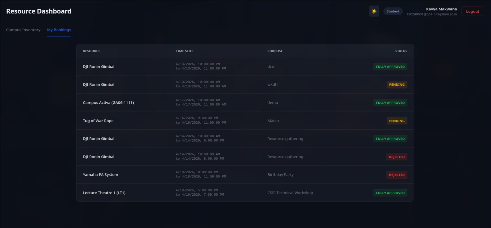
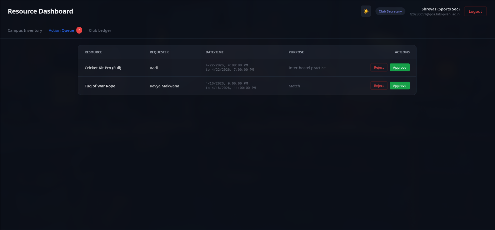
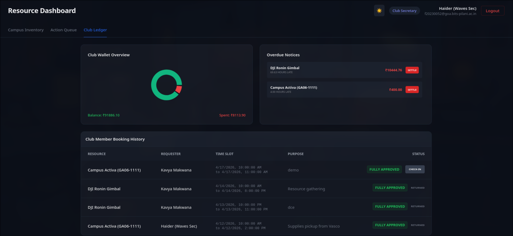
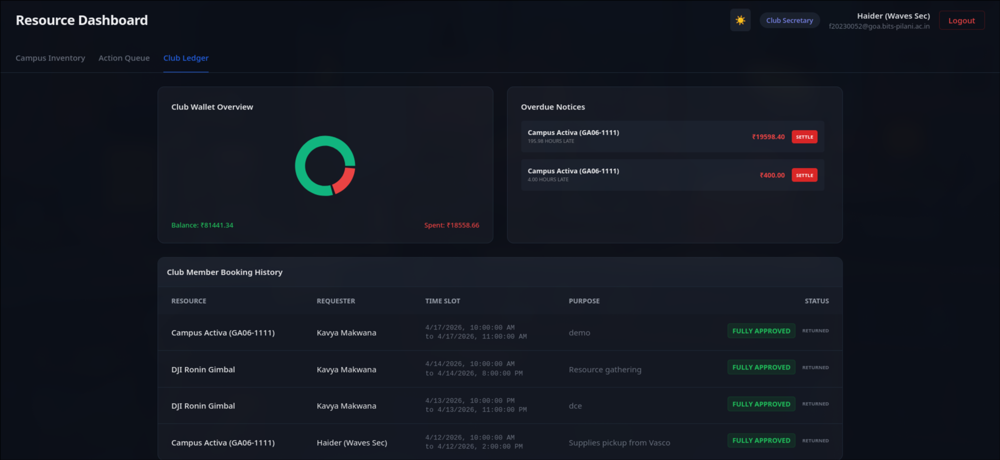
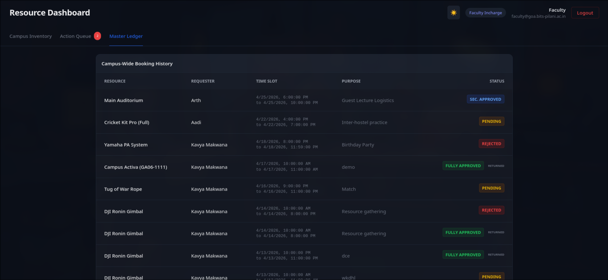
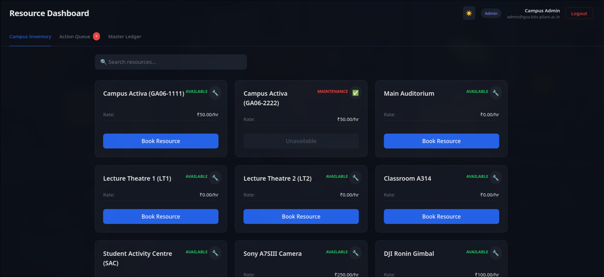
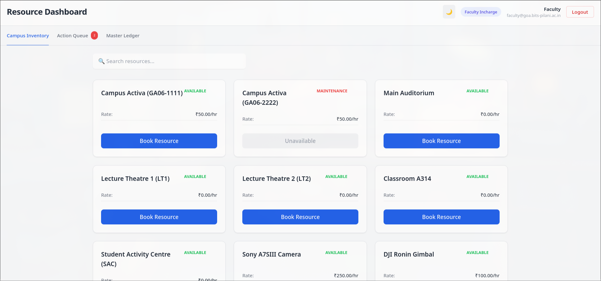

# 🏛️ Campus Inventory & Resource Scheduler (IRS)

Welcome to the **Campus Inventory & Resource Scheduler**, a comprehensive, full-stack database management system designed to streamline campus logistics, club finances, and resource allocation. 

Built with a robust PostgreSQL backend and a dynamic React frontend, this system features a strict Role-Based Access Control (RBAC) architecture to serve Students, Club Secretaries, Faculty In-charges, and Campus Administrators.

---

## 🌟 Key Features Walkthrough

### 1. Secure Authentication
The system uses JWT-based authentication to route users to their role-specific dashboards immediately upon logging in. 

*Clean, minimal login interface handling dynamic routing based on user credentials.*

---

### 2. Student Interface: Seamless Inventory & Booking
Students have a real-time view of campus inventory. The dashboard dynamically disables unavailable resources (like the Campus Activa currently in maintenance) and clearly displays hourly rates.

*The Campus Inventory view, featuring a sleek Dark Mode UI and real-time availability status.*

Booking resources is highly contextual. Students can book on behalf of a specific club (deducting from the club wallet) or make a "Personal Booking" which routes differently through the approval chain.

*The booking modal handling time-slot selection, purpose declaration, and contextual booking associations.*

Students can easily track the status of their requests—from `PENDING` to `FULLY APPROVED` or `REJECTED`—in their personal ledger.

*Personal booking history tracking the lifecycle of database requests.*

---

### 3. Club Secretary: Management & Automated Finances
Club Secretaries act as the first line of approval for their members' requests. The Action Queue isolates requests specific to their organization, keeping the workflow organized.

*The Action Queue where Secretaries approve or reject resource requests before they reach Faculty.*

The crown jewel of the Secretary dashboard is the **Club Ledger**. Powered by complex PostgreSQL triggers, this module tracks the club's live wallet balance, visualizes spending via dynamic charts, and flags overdue notices with late fees.

*The Finance Module: Visualizing budget utilization, overdue penalties, and an audit trail of member bookings.*

---

### 4. Faculty & Admin Oversight
Faculty members maintain a bird's-eye view of campus operations through the **Master Ledger**, which tracks every transaction and request across all clubs and personal bookings. 

*The Master Ledger displaying campus-wide history and current status tags.*

Administrators possess elevated privileges, allowing them to bypass standard booking flows and instantly flag items for maintenance to protect the inventory pool. The platform also fully supports custom themes, like tqhe crisp Light Mode interface.

*Admin view showing elevated maintenance controls (wrench icons).*

*The system's responsive Light Mode theme, demonstrated on the Faculty Dashboard.*

---

## 🛠️ Technical Stack
* **Frontend:** React.js, Tailwind CSS, Recharts (Data Visualization)
* **Backend:** Node.js, Express.js
* **Database:** PostgreSQL (Featuring custom triggers, cascading updates, and RBAC queues)# 🏛️ Campus Inventory & Resource Scheduler (IRS)

Welcome to the **Campus Inventory & Resource Scheduler**, a comprehensive, full-stack database management system designed to streamline campus logistics, club finances, and resource allocation. 

Built with a robust PostgreSQL backend and a dynamic React frontend, this system features a strict Role-Based Access Control (RBAC) architecture to serve Students, Club Secretaries, Faculty In-charges, and Campus Administrators.

---

## 🌟 Key Features Walkthrough

### 1. Secure Authentication
The system uses JWT-based authentication to route users to their role-specific dashboards immediately upon logging in. 

*Clean, minimal login interface handling dynamic routing based on user credentials.*

---

### 2. Student Interface: Seamless Inventory & Booking
Students have a real-time view of campus inventory. The dashboard dynamically disables unavailable resources (like the Campus Activa currently in maintenance) and clearly displays hourly rates.

*The Campus Inventory view, featuring a sleek Dark Mode UI and real-time availability status.*

Booking resources is highly contextual. Students can book on behalf of a specific club (deducting from the club wallet) or make a "Personal Booking" which routes differently through the approval chain.

*The booking modal handling time-slot selection, purpose declaration, and contextual booking associations.*

Students can easily track the status of their requests—from `PENDING` to `FULLY APPROVED` or `REJECTED`—in their personal ledger.

*Personal booking history tracking the lifecycle of database requests.*

---

### 3. Club Secretary: Management & Automated Finances
Club Secretaries act as the first line of approval for their members' requests. The Action Queue isolates requests specific to their organization, keeping the workflow organized.

*The Action Queue where Secretaries approve or reject resource requests before they reach Faculty.*

The crown jewel of the Secretary dashboard is the **Club Ledger**. Powered by complex PostgreSQL triggers, this module tracks the club's live wallet balance, visualizes spending via dynamic charts, and flags overdue notices with late fees.

*The Finance Module: Visualizing budget utilization, overdue penalties, and an audit trail of member bookings.*

---

### 4. Faculty & Admin Oversight
Faculty members maintain a bird's-eye view of campus operations through the **Master Ledger**, which tracks every transaction and request across all clubs and personal bookings. 

*The Master Ledger displaying campus-wide history and current status tags.*

Administrators possess elevated privileges, allowing them to bypass standard booking flows and instantly flag items for maintenance to protect the inventory pool. The platform also fully supports custom themes, like tqhe crisp Light Mode interface.

*Admin view showing elevated maintenance controls (wrench icons).*

*The system's responsive Light Mode theme, demonstrated on the Faculty Dashboard.*

---

## 🛠️ Technical Stack
* **Frontend:** React.js, Tailwind CSS, Recharts (Data Visualization)
* **Backend:** Node.js, Express.js
* **Database:** PostgreSQL (Featuring custom triggers, cascading updates, and RBAC queues)
